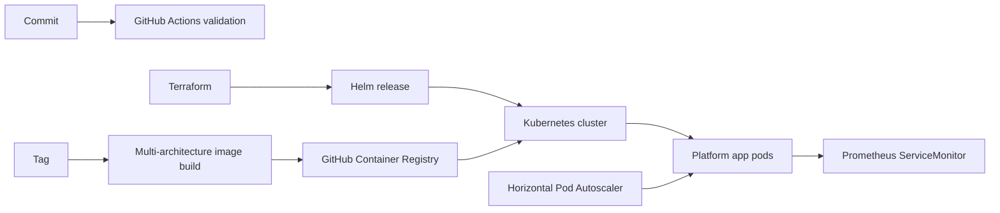

# Platform architecture

## Responsibility boundaries

This repository deploys a workload **into an existing Kubernetes cluster**. It intentionally does not create an EKS cluster: cluster lifecycle, networking, and organization-wide add-ons normally belong to a separately owned infrastructure stack and state file.

Terraform owns the namespace and Helm release. Helm owns namespaced workload resources. The container image is built from the sample service and published to GHCR only for version tags.

## Availability

- Rolling updates allow zero unavailable replicas.
- Readiness and liveness probes separate traffic eligibility from restart health.
- The HPA responds to CPU utilization while the disruption budget protects voluntary maintenance.
- Production values spread replicas across availability zones when the cluster exposes zone labels.
- Helm releases are atomic and retain five revisions for rollback.

## Security

- Pods run as UID/GID 65532 with a read-only root filesystem and all Linux capabilities dropped.
- Service account tokens are not mounted because the workload does not call the Kubernetes API.
- The namespace enforces the restricted Pod Security Standard.
- NetworkPolicy limits inbound application traffic and outbound DNS.
- CI validates rendered manifests and builds the image before changes merge.

## Observability

The service exposes Prometheus metrics at `/metrics`. `ServiceMonitor` is optional because it requires the Prometheus Operator CRDs. Health and readiness endpoints are available at `/health` and `/ready`.
